# 快速入门

本文介绍在鸿蒙平台下如何快速集成云信 NIMSDK 到项目中:

一、环境要求

二、SDK 接入流程

三、Demo 使用

四、问题反馈

五、参考

通过以上步骤，您可以基本了解鸿蒙NIMSDK 的接入与使用。

## 一、环境要求
### 1.1 编译环境
- DevEco Studio NEXT Developer Beta1（5.0.3.403） 及以上。
- HarmonyOS SDK API 11 及以上。
- 运行环境 HarnomyOS NEXT 2.1.2.5 (Canary1) 以上

### 1.2 设备要求

- 真机华为 Mate 系列
- 操作系统 HarnomyOS NEXT 2.1.2.5 (Canary1) 以上

> 于“设置”->“关于手机”页面查看

### 1.3 操作步骤

#### 步骤 1.3.1 ：创建应用

创建应用，详情官方文档：[点这里](https://netease.im/)

#### 步骤 1.3.2：编译运行

打开 NIMAPIDemo 配置签名：当前 NIMAPIDemo 已经配置好 Huawei Phone 模拟器与部分网易内部 HarmonyOS NEXT 真机的安装证书与 Profile，支持所有模拟器安装应用。若期望将证书移动到私有华为开发者账号体系下，需要按照一下步骤自动生成。更详细步骤详见 [华为-创建 HarmonyOS 应用](https://developer.huawei.com/consumer/cn/doc/app/agc-help-createapp-0000001146718717)

##### DevEcho-Studio -> File -> Project Structure
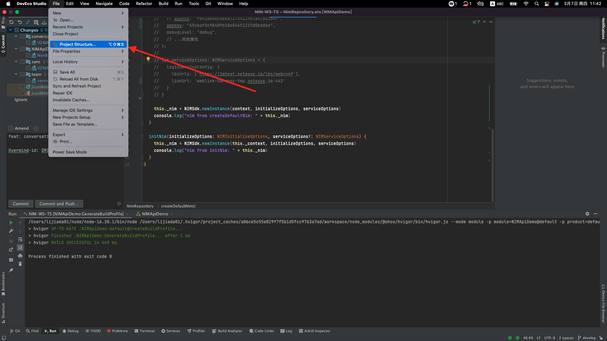
##### Project Structure -> Project -> Signing Configs
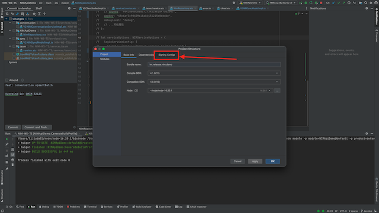
##### Signing Configs -> check "Automatically generate signature" -> click "Sing in" 登录授权的华为开发者账号
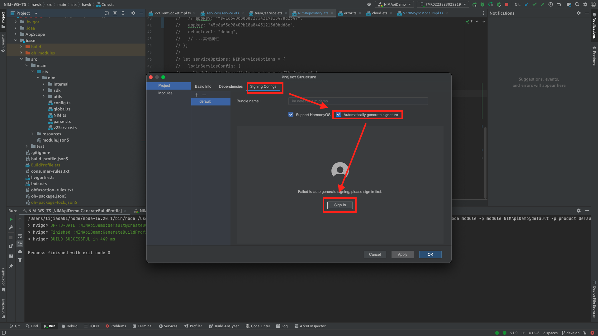
##### 在弹出的浏览器页面点击“允许”，许可颁布应用调试证书
##### 选择名称为“NIMAPIDemo”的应用和名为“”模拟器后，点击 ▶ 即可在模拟器运行 HarmonyOS NIMSDK API Demo ！
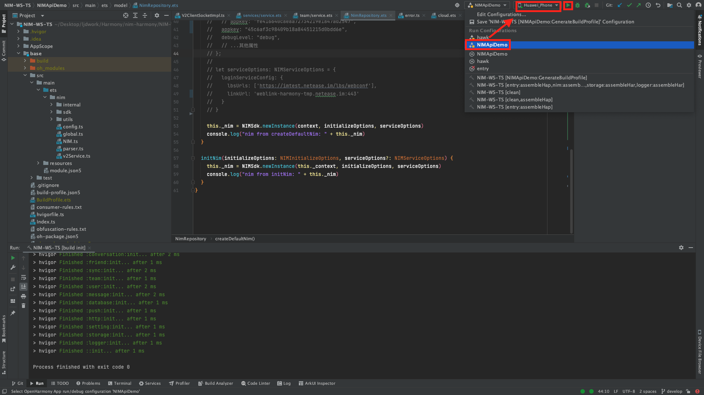


#### 步骤 1.3.3：真机运行（可选）
  如果使用模拟器，可以直接运行，如果需要真机调试，[详情参考](./On-deviceDebugging.md)

## 二、SDK 接入流程
### 架构图
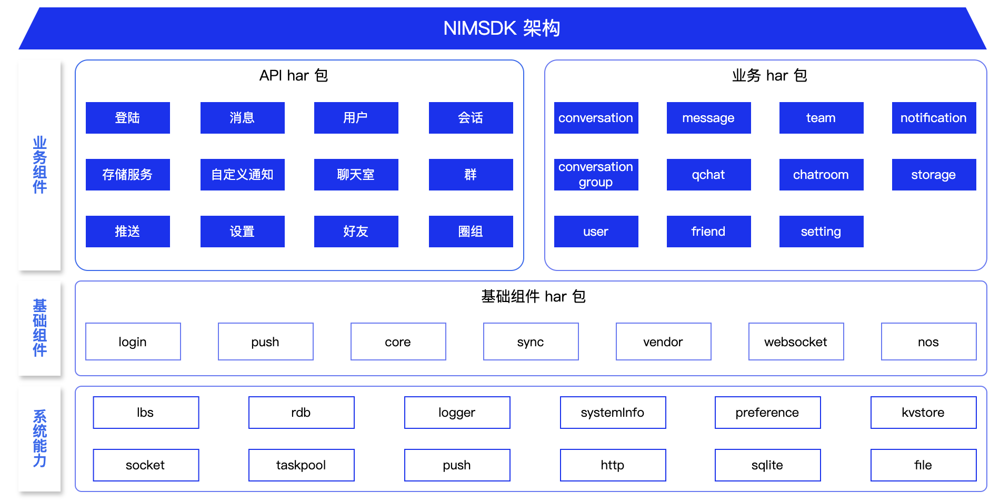

IMSDK 提供如下产品功能：登录、会话、消息、群组、用户、好友、存储服务、推送、自定义通知、设置、信令、聊天室、圈组等功能。

对应上述功能提供业务组件 har 包包括 connversation、conversationgroup、message、team、user、friend、setting、notifation、signalling、chatroom、 qchat（开发中，暂不提供）。


### 2.1. 拷贝 SDK har 

将 SDK 文件拷贝到 Harmony 工程，例如放至 `entry` 模块下的 `libs` 目录。

### 2.2 配置 har 包本地依赖

修改模块目录的 `oh-package.json5` 文件，在 `dependencies` 节点增加依赖声明。
```
{
    "name": "entry",
    "version": "1.0.0",
    "description": "Please describe the basic information.",
    "main": "",
    "author": "",
    "license": "",
    
    ...
    
    "dependencies": {
        <!-- 业务模版har包， 可以按需添加 -->
        "@nimsdk/login": "file:../../libs/login.har",
        "@nimsdk/conversation": "file:../../libs/conversation.har",
        "@nimsdk/conversationgroup": "file:../../libs/conversationgroup.har",
        "@nimsdk/message": "file:../../libs/message.har",
        "@nimsdk/team": "file:../../libs/team.har",
        "@nimsdk/user": "file:../../libs/user.har",
        "@nimsdk/friend": "file:../../libs/friend.har",
        "@nimsdk/signalling": "file:../../libs/signalling.har",
        "@nimsdk/setting": "file:../../libs/setting.har",
        "@nimsdk/notification": "file:../../libs/notification.har",
        <!-- Harmony IMSDK 基础业务模块，必须添加 -->
        "@nimsdk/nim": "file:./libs/nim.har",
        "@nimsdk/base": "file:./libs/base.har",
        "@nimsdk/vendor": ">= 0.7.0",
    }
  ...
}
```

### 2.3 初始化
#### 2.3.1 注册服务

调用 `NIMSdk.registerCustomServices` 方法注册使用的服务。

- 参数说明

  ```
  static registerCustomServices(serviceType: V2NIMProvidedServiceType, creator: V2ServiceCreator)
  ```
  参数                | 类型                       | 说明               |
  ------------------- | -------------------------- | ------------------ |
  `serviceType`      | `V2NIMProvidedServiceType` | 服务类型         |
  `creator`          | `V2ServiceCreator`         | 服务构造器       |

- 示例代码

  ```typescript
  // 根据业务，选择所需服务进行注册
    NIMSdk.registerCustomServices(V2NIMProvidedServiceType.V2NIM_PROVIDED_SERVICE_TEAM, (core, serviceName, serviceConfig) => new V2NIMTeamServiceImpl(core, serviceName, serviceConfig))
    NIMSdk.registerCustomServices(V2NIMProvidedServiceType.V2NIM_PROVIDED_SERVICE_CLIENT_ANTISPAM_UTIL, (core, serviceName, serviceConfig) => new V2NIMClientAntispamUtil(core, serviceName, serviceConfig));
    NIMSdk.registerCustomServices(V2NIMProvidedServiceType.V2NIM_PROVIDED_SERVICE_NOTIFICATION, (core, serviceName, serviceConfig) => new V2NIMNotificationServiceImpl(core, serviceName, serviceConfig));
    NIMSdk.registerCustomServices(V2NIMProvidedServiceType.V2NIM_PROVIDED_SERVICE_CONVERSATION, (core, serviceName, serviceConfig) => new V2NIMConversationServiceImpl(core, serviceName, serviceConfig));
    NIMSdk.registerCustomServices(V2NIMProvidedServiceType.V2NIM_PROVIDED_SERVICE_CONVERSATION_GROUP, (core, serviceName, serviceConfig) => new V2NIMConversationGroupServiceImpl(core, serviceName, serviceConfig));
    NIMSdk.registerCustomServices(V2NIMProvidedServiceType.V2NIM_PROVIDED_SERVICE_MESSAGE, (core, serviceName, serviceConfig) => new V2NIMMessageServiceImpl(core, serviceName, serviceConfig));
    NIMSdk.registerCustomServices(V2NIMProvidedServiceType.V2NIM_PROVIDED_SERVICE_USER, (core, serviceName, serviceConfig) => new V2NIMUserServiceImpl(core, serviceName, serviceConfig));
    NIMSdk.registerCustomServices(V2NIMProvidedServiceType.V2NIM_PROVIDED_SERVICE_FRIEND, (core, serviceName, serviceConfig) => new V2NIMFriendServiceImpl(core, serviceName, serviceConfig));
    NIMSdk.registerCustomServices(V2NIMProvidedServiceType.V2NIM_PROVIDED_SERVICE_SETTING, (core, serviceName, serviceConfig) => new V2NIMSettingServiceImpl(core, serviceName, serviceConfig));
    NIMSdk.registerCustomServices(V2NIMProvidedServiceType.V2NIM_PROVIDED_SERVICE_SIGNALLING, (core, serviceName, serviceConfig) => new V2NIMSignallingServiceImpl(core, serviceName, serviceConfig))
  ```

#### 2.3.2 初始化

调用 `newInstance` 方法创建实例并实现初始化。

- 参数说明

  ```
  static newInstance(context: common.Context, initializeOptions: NIMInitializeOptions, serviceOptions: NIMServiceOptions = {}): NIMInterface
  ```

  参数                | 类型                       | 说明               |
  ------------------- | -------------------------- | ------------------ |
  `context`           | common.Context             | 应用上下文         |
  `initializeOptions` | `NIMInitializeOptions` | SDK 的配置信息     |
  `serviceOptions`    | `NIMServiceOptions`    | 业务服务的配置信息 |

  `NIMInitializeOptions` 的配置参数

  参数         | 类型   | 必填                | 说明                                                         |
  ------------------ | ------ | ------------------- | ------------------------------------------------------------ |
  `appkey`        | string | 是                  | 应用的 App Key，在云信控制台[创建应用](https://doc.yunxin.163.com/console/guide/TIzMDE4NTA?platform=console)后获取。 |
  `xhrConnectTimeout`   | number | 否，默认为 30000 ms | 建立连接时的 xhr 请求的超时时间                              |
  `socketConnectTimeout` | number | 否，默认为 30000 ms | 建立 websocket 连接的超时时间                                |

  `NIMServiceOptions` 的配置参数

  参数        | 类型                  | 必填 | 说明                   |
  ---------------- | --------------------- | ---- | ---------------------- |
  `loginServiceConfig` | `NIMLoginServiceConfig` | 否   | LoginService的配置参数 |

  `NIMLoginServiceConfig` 的配置参数

  参数               | 类型     | 必填 | 说明                                                         |
  ------------------ | -------- | ---- | ------------------------------------------------------------ |
  `lbsUrls`          | string[] | 否   | lbs 地址。SDK 连接时会向 lbs 地址请求得到 socket 连接地址    |
  `linkUrl`          | string   | 否   | socket 备用地址，当 lbs 请求失败时，尝试直接连接 socket 备用地址 |
  `customClientType` | number   | 否   | 自定义客户端类型                                             |
  `customTag`        | string   | 否   | 自定义客户端标签                                             |

- 示例代码

  ```typescript
  let initializeOptions: NIMInitializeOptions = {
    appkey: "45c6af3c98409b18a84451215d0bdd6e",
  };

  let serviceOptions: NIMServiceOptions = {
    loginServiceConfig: {
      lbsUrls: ['https://imtest.netease.im/lbs/webconf'],
      linkUrl: 'weblink-harmony-tmp.netease.im:443'
    }
  }

  const nim = NIMSdk.newInstance(context, initializeOptions, serviceOptions)
  

## 三、DEMO 使用

demo 提供 IM 个业务模块 API 的调用事例，便于开发者快速了解 api 的使用方式，下载 demo 代码后，可以直接运行
demo 运行进入登陆界面进行登陆：
体验 demo 可以将 用户名：cjl 秘密： 123456 输入进行登陆：

### 3.1 登陆界面
> see loginService

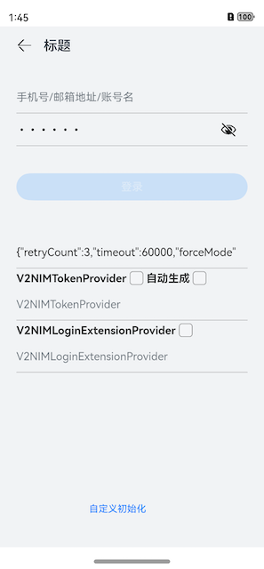

### 3.2 会话接口
> see conversationService

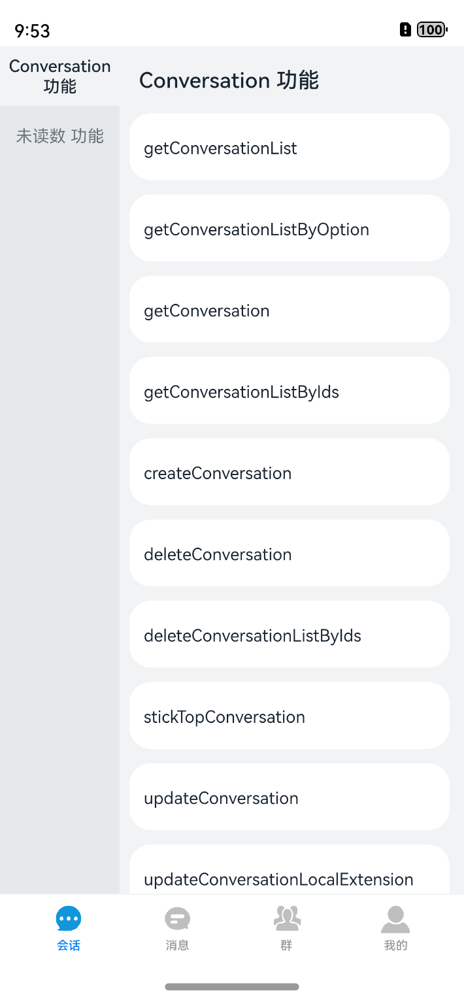

### 3.3 消息接口
> see messageService

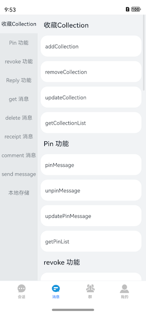

### 3.4 群接口
> see teamService

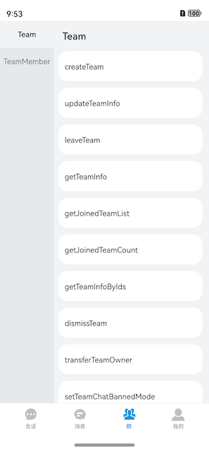

### 3.5 用户&好友接口
> see userService, friendService

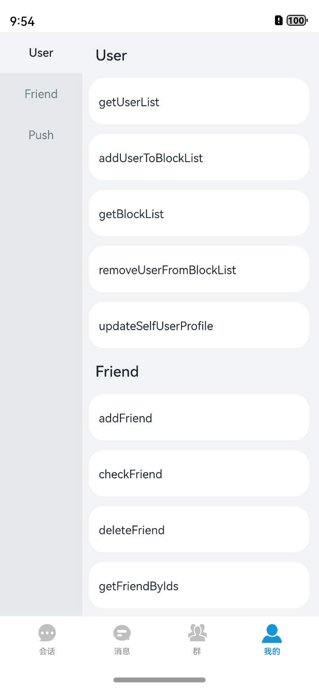

### 3.6 离线推送
> see pushService

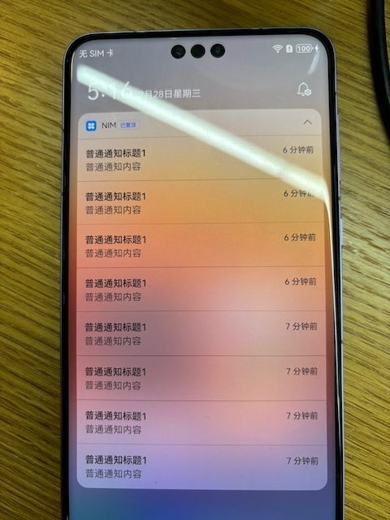

以上界面对应的功能接口，都有单独的功能页面进行实现，在接入sdk 时，可以找的对应的接口，进行参考使用。


## 四、问题反馈

如果您在使用过程中，有任何疑问都可以直接在本工程上提交 issue，或者在云信官网进行咨询。

## 五、参考
[云信官网](https://netease.im/)

[鸿蒙开发官网](https://developer.harmonyos.com/)
