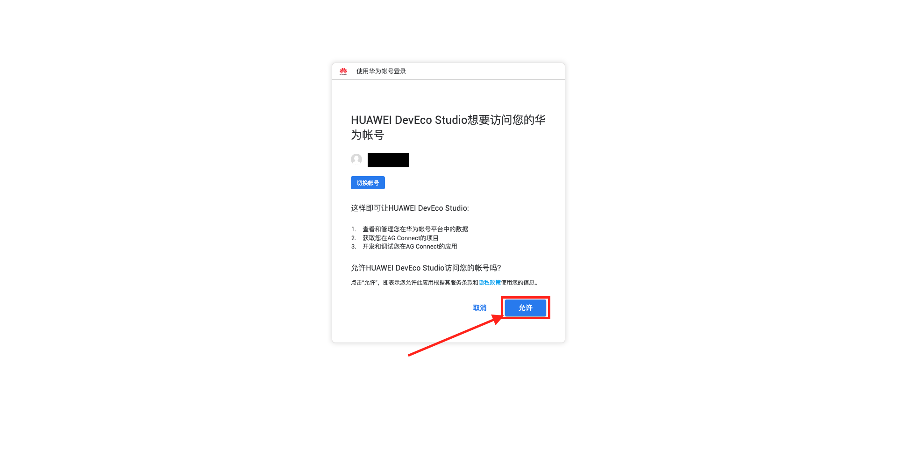
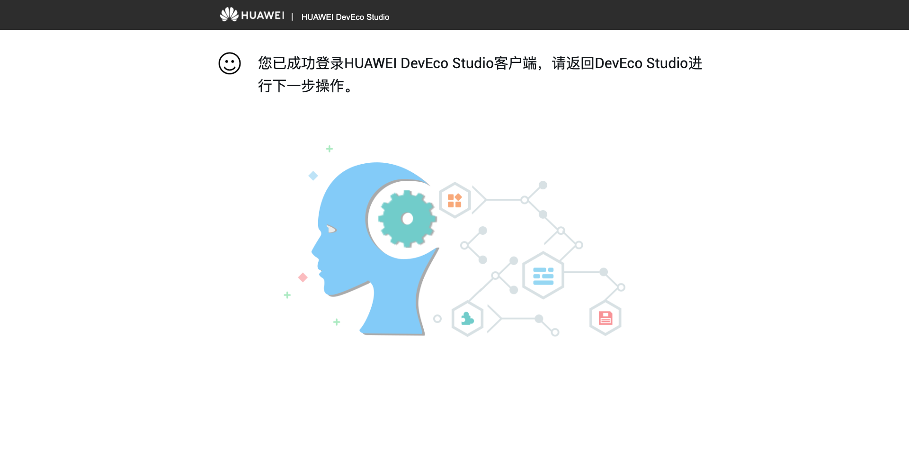
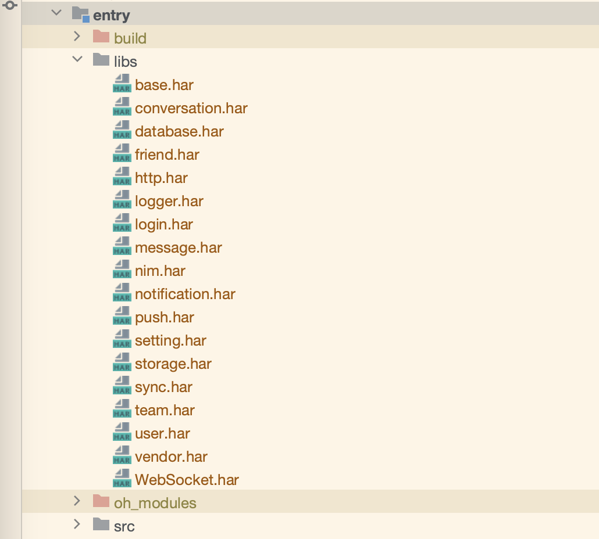
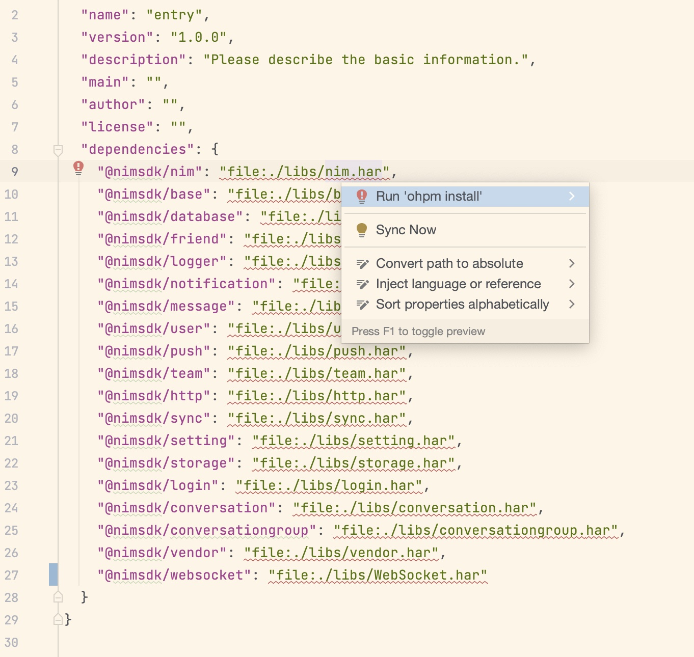
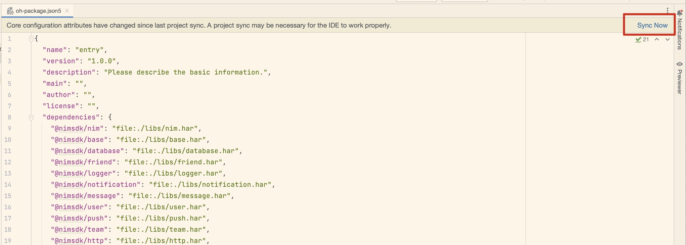
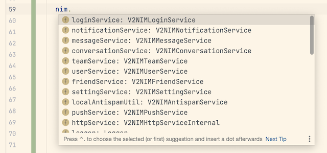

# 快速入门

本文介绍在鸿蒙平台下如何快速集成云信 NIMSDK 到项目中:

一、环境要求

二、SDK 接入流程

三、Demo 使用

四、问题反馈

五、参考

通过以上步骤，您可以基本了解鸿蒙NIMSDK 的接入与使用。

## 一、环境要求
### 1.1 编译环境
- DevEco Studio NEXT Developer Preview1（4.1.3.500） 及以上。
- HarmonyOS SDK API 11 及以上。

### 1.2 设备要求

- 真机华为 Mate 系列
- 操作系统 HarnomyOS NEXT 2.1.2.5 (Canary1) 以上

> 于“设置”->“关于手机”页面查看

### 1.3 操作步骤

#### 步骤 1.3.1 ：创建应用

创建应用，详情官方文档：[点这里](https://netease.im/)

#### 步骤 1.3.2：编译运行

打开 NIMAPIDemo 配置签名：当前 NIMAPIDemo 已经配置好 Huawei Phone 模拟器与部分网易内部 HarmonyOS NEXT 真机的安装证书与 Profile，支持所有模拟器安装应用。若期望将证书移动到私有华为开发者账号体系下，需要按照一下步骤自动生成。更详细步骤详见 [华为-创建 HarmonyOS 应用](https://developer.huawei.com/consumer/cn/doc/app/agc-help-createapp-0000001146718717)

##### DevEcho-Studio -> File -> Project Structure

##### Project Structure -> Project -> Signing Configs

##### Signing Configs -> check "Automatically generate signature" -> click "Sing in" 登录授权的华为开发者账号

##### 在弹出的浏览器页面点击“允许”，许可颁布应用调试证书

##### 显示此页面时，即代表配置完成

##### 选择名称为“NIMAPIDemo”的应用和名为“”模拟器后，点击 ▶ 即可在模拟器运行 HarmonyOS NIMSDK API Demo ！


#### 步骤 1.3。3：真机运行（可选）
  如果使用模拟器，可以直接运行，如果需要真机调试，[详情参考](./On-deviceDebugging.md)

## 二、SDK 接入流程
### 架构图


IMSDK 提供如下产品功能： 登陆、会话、消息、群、用户、好友、存储服务、推送、自定义通知、设置、聊天室、圈组功能。

对应上述功能提供业务组件har包：connversation、conversationgroup、message、team、user、friend、setting、notifation、storage、qchat、chatroom。

目前 qchat 和 chatroom 功能还在开发中，不提供。

### 2.1. 拷贝 SDK har 

拷贝 sdk har 包产物至项目文件夹中，例如：entry/libs。产物成果可由 [NIMApiDemo/entry/libs](./NIMApiDemo/entry/libs) 获取



### 2.2 配置 har 包本地依赖

DEMO 工程下 oh-package.json5 配置 har 包依赖。即将 har 包路径配置在 entry/oh-package.json5 的 "dependencies" 字段下：

```json
{
  "name": "entry",
  "version": "1.0.0",
  "description": "Please describe the basic information.",
  "main": "",
  "author": "",
  "license": "",
  "dependencies": {
    "@nimsdk/nim": "file:./libs/nim.har",
    "@nimsdk/base": "file:./libs/base.har",
    "@nimsdk/database": "file:./libs/database.har",
    "@nimsdk/friend": "file:./libs/friend.har",
    "@nimsdk/logger": "file:./libs/logger.har",
    "@nimsdk/notification": "file:./libs/notification.har",
    "@nimsdk/message": "file:./libs/message.har",
    "@nimsdk/user": "file:./libs/user.har",
    "@nimsdk/push": "file:./libs/push.har",
    "@nimsdk/team": "file:./libs/team.har",
    "@nimsdk/http": "file:./libs/http.har",
    "@nimsdk/sync": "file:./libs/sync.har",
    "@nimsdk/setting": "file:./libs/setting.har",
    "@nimsdk/storage": "file:./libs/storage.har",
    "@nimsdk/login": "file:./libs/login.har",
    "@nimsdk/conversation": "file:./libs/conversation.har",
    "@nimsdk/conversationgroup": "file:./libs/conversationgroup.har",
    "@nimsdk/vendor": "file:./libs/vendor.har",
    "@nimsdk/WebSocket": "file:./libs/WebSocket.har"
  }
}
```

### 2.3 安装本地 har 包依赖

鼠标移动至红色波浪线位置停滞片刻，将会弹出提示框。点击 Run 'ohpm install'，即刻安装本地 har 包依赖



### 2.4 同步项目工程

点击 Sync Now，同步项目工程



### 2.5 创建 SDK 实例 SampleCode

引入 SDK SampleCode，创建SDK实例。使用 import 引入 NIMInterface，NIMInitializeOptions，NIMServiceOptions，NIMSdk

```javascript
import { NIMInterface, NIMInitializeOptions, NIMServiceOptions } from '@nimsdk/base'
import { NIMSdk } from '@nimsdk/nim'
```

初始化


### 2.6 通过SDK实例获取各业务service，通过业务service进行功能开发




## 三、DEMO 使用

demo 提供 IM 个业务模块 API 的调用事例，便于开发者快速了解 api 的使用方式，下载 demo 代码后，可以直接运行
demo 运行进入登陆界面进行登陆：
体验 demo 可以将 用户名：cjl 秘密： 123456 输入进行登陆：

### 3.1 登陆界面
> see loginService


### 3.2 会话接口
> see conversationService


### 3.3 消息接口
> see messageService


### 3.4 群接口
> see teamService


### 3.5 用户&好友接口
> see userService, friendService


### 3.6 离线推送
> see pushService


以上界面对应的功能接口，都有单独的功能页面进行实现，在接入sdk 时，可以找的对应的接口，进行参考使用。


## 四、问题反馈

如果您在使用过程中，有任何疑问都可以直接在本工程上提交 issue，或者在云信官网进行咨询。

## 五、参考
[云信官网](https://netease.im/)

[鸿蒙开发官网](https://developer.harmonyos.com/)
