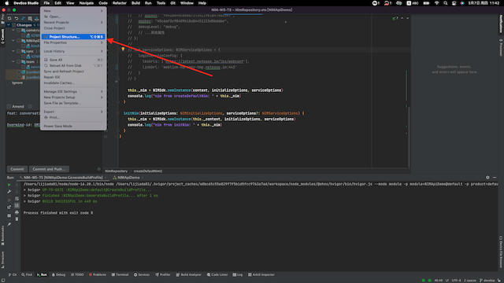
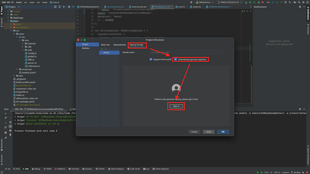
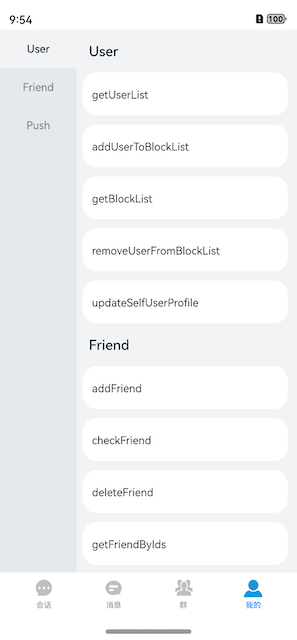

# 快速入门

本文介绍在鸿蒙平台下如何快速集成云信 NIMSDK 到项目中:

一. 环境要求

二. SDK 接入流程

三. Demo 使用
   

通过以上步骤，您可以基本了解鸿蒙NIMSDK 的接入与使用。

## 一.环境要求
### 编译器
- DevEco Studio NEXT Developer Preview1（4.1.3.500） 及以上。
- HarmonyOS SDK API 11 及以上。

### 设备

- 真机华为 Mate 系列
- 操作系统 HarnomyOS NEXT 2.1.2.5 (Canary1) 以上

> 于“设置”->“关于手机”页面查看
  
## 操作步骤

### 步骤1：创建应用

创建应用，详情官方文档：[点这里](https://netease.im/)

### 步骤2：编译运行

1.打开 NIMAPIDemo 配置签名：

当前 NIMAPIDemo 已经配置好 Huawei Phone 模拟器与部分网易内部 HarmonyOS NEXT 真机的安装证书与 Profile，支持所有模拟器安装应用。若期望将证书移动到私有华为开发者账号体系下，需要按照一下步骤自动生成。更详细步骤详见 [华为-创建 HarmonyOS 应用](https://developer.huawei.com/consumer/cn/doc/app/agc-help-createapp-0000001146718717)

DevEcho-Studio -> File -> Project Structure

Project Structure -> Project -> Signing Configs

Signing Configs -> check "Automatically generate signature" -> click "Sing in" 登录授权的华为开发者账号

在弹出的浏览器页面点击“允许”，许可颁布应用调试证书

显示此页面时，即代表配置完成

选择名称为“NIMAPIDemo”的应用和名为“”模拟器后，点击 ▶ 即可在模拟器运行 HarmonyOS NIMSDK API Demo ！

### 步骤3：真机运行
  如果使用模拟器，可以直接运行，如果需要真机调试，详细参考文档

  [详情参考](/真机调试.md)

## 三. DEMO 使用

demo 提供 IM 个业务模块 API 的调用事例，便于开发者快速了解 api 的使用方式，下载 demo 代码后，可以直接在模拟器上运行，参考：[真机运行](#build-for-use)

demo 运行进入登陆界面进行登陆：
体验 demo 可以将 用户名：cjl 秘密： 123456 输入进行登陆：

### Demo 功能模块
#### 登陆界面

#### 会话接口

#### 消息接口

#### 群接口

#### 用户&好友接口

#### 离线推送

以上界面对应的功能接口，都有单独的功能页面进行实现，在接入sdk 时，可以找的对应的接口，进行参考使用。

## 问题反馈

如果您在使用过程中，有任何疑问都可以直接在本工程上提交 issue，或者在云信官网进行咨询。

## 参考
[云信官网](https://netease.im/)

[鸿蒙开发官网](https://developer.harmonyos.com/)
