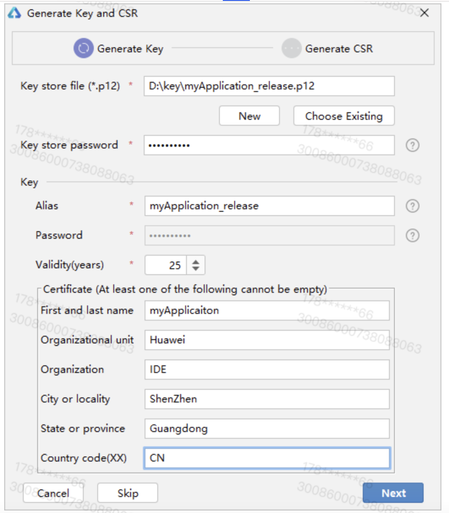
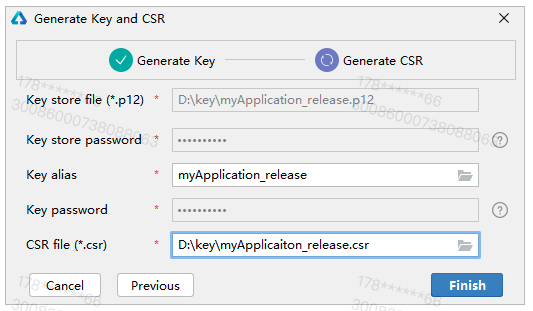
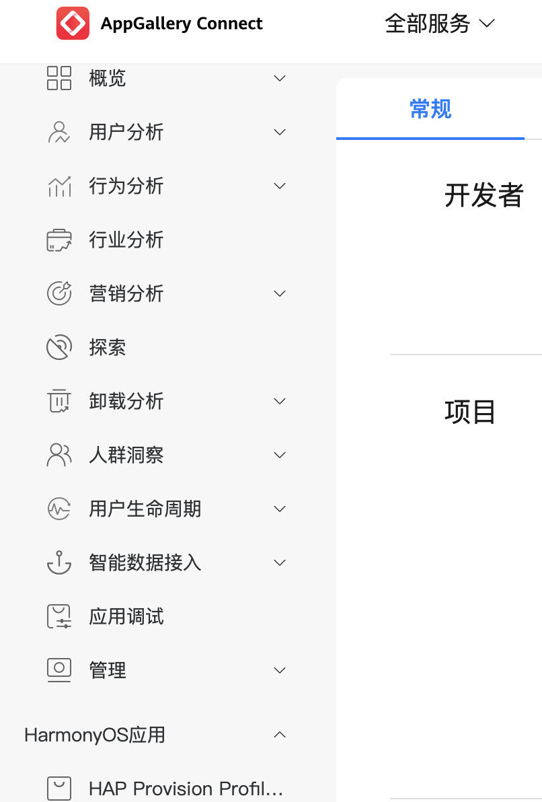
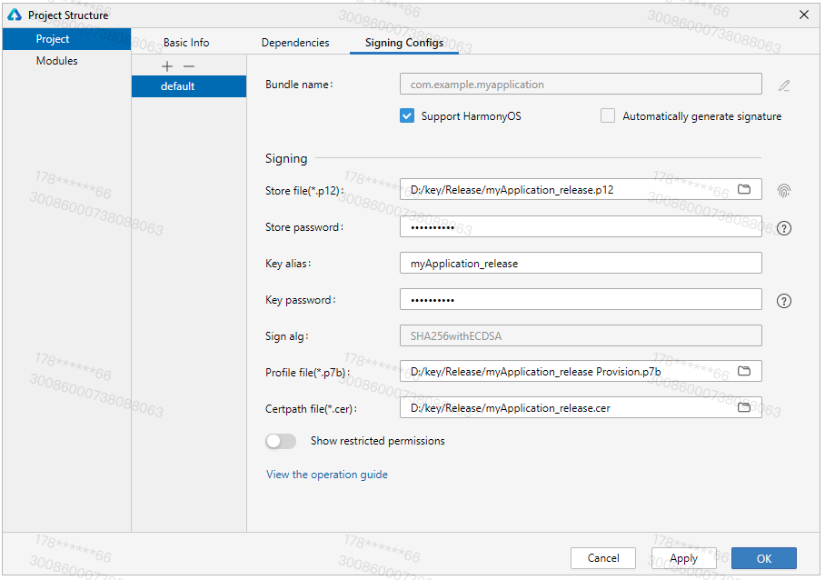
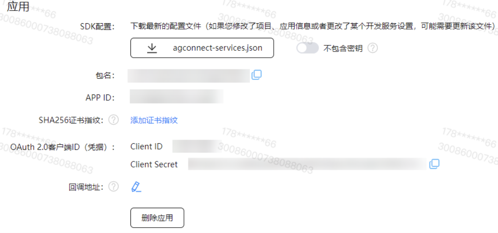

## 真机调试
> PS：真机能否安装依赖 build-profile.json5 中的证书与 Profile 文件配置，
### 基本概念
#### 密钥(.p12)
包含非对称加密中使用的公钥和私钥，存储在密钥库文件中，格式为.p12，公钥和私钥对用于数字签名和验证。
#### 证书请求文件(.csr)
格式为.csr，全称为Certificate Signing Request，包含密钥对中的公钥和公共名称、组织名称、组织单位等信息，用于向AppGallery Connect申请数字证书。
#### 数字证书(.cer)
格式为.cer，由华为AppGallery Connect颁发。
#### Profile文件(.p7b)
格式为.p7b，包含HarmonyOS应用/服务的包名、数字证书信息、描述应用/服务允许申请的证书权限列表，以及允许应用/服务调试的设备列表（如果应用/服务类型为Release类型，则设备列表为空）等内容，每个应用/服务包中均必须包含一个Profile文件。

### Generate Key(.p12) + Generate CSR(.csr)
主要分为两步，Generate Key(.p12) + Generate CSR(.csr)，IDE 提供了一个入口生成两个文件。

- 使用 IDE DevEco Studio -> Build -> Generate Key and CSR 按需填入
Key Store File：设置密钥库文件存储路径，并填写p12文件名。
- Key Store Password：设置密钥库密码，必须由大写字母、小写字母、数字和特殊符号中的两种以上字符的组合，长度至少为8位。请记住该密码，后续签名配置需要使用。
- Alias：密钥的别名信息，用于标识密钥名称。请记住该别名，后续签名配置需要使用。也是 Key alias
- Password：密钥对应的密码，与密钥库密码保持一致，无需手动输入。也是 Key password。**完成 .p12 创建 （1/4）**

- Generate Key and CSR界面，设置CSR文件存储路径和CSR文件名。**完成 .csr 创建 （2/4）**


### Generate Certificaiton(.cer)
在 AppGallery Connect 平台使用上一步申请的 .csr 生成 .cer，再用 .cer 生成 .p7b

- 登录AppGallery Connect，选择“用户与访问”。

- 在左侧导航栏选择“证书管理”，进入证书管理页面，点击“新增证书”。

- 在弹出的“新增证书”窗口，填写要申请的证书信息，点击“提交”。
- 证书类型：调试证书（有效期 1 年）；发布证书（有效期 3 年）。
- 选取证书申请文件（CSR）：传入本机生成的 .csr 文件
- **完成 .cer 创建（3/4）**，需下载后配置


### Generate Profile(.p7b)

在 AppGallery Connect 平台使用上一步申请的 .csr 生成 .cer，再用 .cer 生成 .p7b

- 登录AppGallery Connect
- 点击“我的项目”，找到自己的项目，点击创建完成的HarmonyOS应用；
- 关注左侧导航栏，选择“HarmonyOS应用 > HAP Provision Profile管理
- 点击“添加”，添加“发布”或“调试” Profile 文件
	- 发布：选择 .cer 发布证书
	- 调试：选择 .cer 调试证书，并指定调试设备（真机需要在注册在当前开发账户，模拟器不受限制）
- **完成 .p7b 创建（4/4）**，需下载后配置



### 配置签名信息

“准备签名文件”的步骤拿到 4 个重要签名文件，分别作用：

- .p12：本地保存，工程项目配置（重要）
- .csr：本地保存，用户上传 AppGallery Connect -> 用户与访问 -> 证书管理 -> 生成 .cer
- .cer：AppGallery Connect 保存，开发证书，下载后用于工程项目配置
- .p7b：AppGallery Connect 保存，Profile 文件，下载后用于工程项目配置

使用制作的私钥（.p12）文件、在AppGallery Connect中申请的证书（.cer）文件和Profile（.p7b）文件，在DevEco Studio配置工程的签名信息，构建携带发布签名信息的APP。

用 DevEco Studio 打开自己的鸿蒙工程，在 File > Project Structure > Project > Signing Configs > default界面中，取消“Automatically generate signature”勾选项，然后配置工程的签名信息。需要注意的是，除了传入 .p12, .cer, .p7b 以外，需要填入创建 .p12 时的 Key alias 和 Key password，具体规则如下：
> 注意此时要取消“Automatically generate signature”勾选项



* Store File：选择密钥库文件，文件后缀为.p12。
* Store Password：输入密钥库密码。
* Key Alias：输入密钥的别名信息。
* Key Password：输入密钥的密码。
* Sign Alg：签名算法，固定为SHA256withECDSA。
* Profile File：选择申请的发布Profile文件，文件后缀为.p7b。
* Certpath File：选择申请的发布数字证书文件，文件后缀为.cer。
* OK
* 配置完毕后，Project 的 build-profile.json5 能查看配置结果

### 配置签名证书指纹

见文档，[“配置签名证书指纹”章节](https://developer.harmonyos.com/cn/docs/documentation/doc-guides-V2/configure-0000001709533666-V2#section081064303716)

* 登录 AppGallery Connect 网站，点击“我的项目”。
* 在项目列表中找到您的项目，在项目中点击需要配置签名证书指纹的应用。
* 在“项目设置 > 常规”页面的“应用”区域，点击“SHA256证书指纹”后的“添加公钥指纹 (HarmonyOS API 9及以上)”生成

### 配置Client ID

见文档，[“配置Client ID”章节](https://developer.harmonyos.com/cn/docs/documentation/doc-guides-V2/configure-0000001709533666-V2#section93453261371)

* 登录AppGallery Connect网站，选择“我的项目”，在项目列表中找到您的项目，下拉页面，获取Client ID。

* 在工程中entry模块的module.json5文件中，新增metadata并配置client_id，如下所示：
```
"module": {
  "name": "entry",
  "type": "xxx",
  "description": "xxxx",
  "mainElement": "xxxx",
  "deviceTypes": [],
  "pages": "xxxx",
  "abilities": [],
  "metadata": [ // 配置如下信息
    {
      "name": "client_id",
      "value": "xxxxxx"  // 配置为截图中的Client ID
    }
    {
      "name": "app_id",
      "value": "xxxxxx"  // 配置为截图中的 APP ID
    }
  ]
}
```
